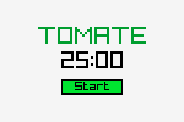

# Tomate

<p align=center>
  
</p>

A simple Pomodoro Timer written in C.

## Usage

To launch the program:
```script
tomate
```

## Dependencies

- gcc
- [raylib](https://github.com/raysan5/raylib)

## Compiling

To compile simply run:

```script
./build.sh
```

## License

Tomate is licensed under MIT license. For further information check [LICENSE](LICENSE).
